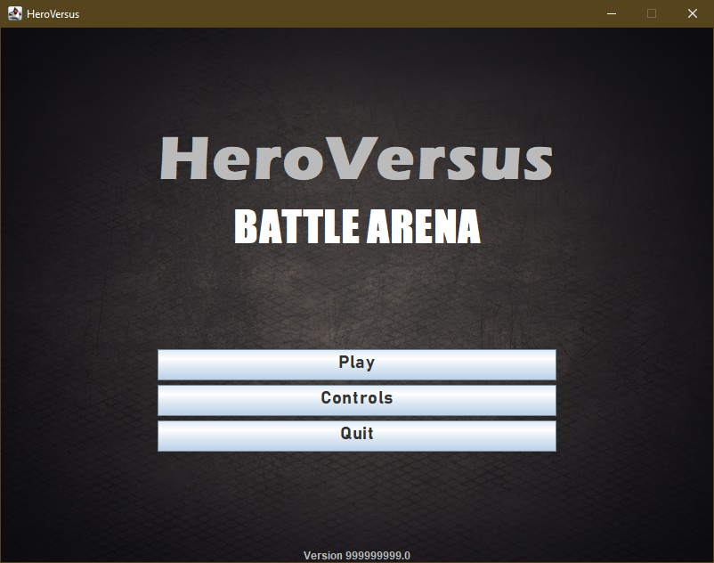

# HeroVersus: Battle Arena

Welcome to **HeroVersus: Battle Arena**, a dynamic 2-player 2D fighting game developed as part of the IN1007 Programming in Java module at City, University of London. This project showcases a combination of object-oriented programming techniques and game development strategies using Java.

**HeroVersus: Battle Arena** pits two players against each other in a competitive fighting match set in various unique arenas. Each character boasts distinct abilities and moves, enhancing the strategic depth and replayability of the game.

## Coursework Details

- **Course**: IN1007 Programming in Java
- **Institution**: City, University of London
- **Term**: Spring 2023

> **Note**: This repository was originally created under @cityteaching and has been cloned here for public visibility.

## Gameplay Screenshots

### Title Screen



This screenshot shows the game's title screen, featuring a captivating background along with the main menu options: Play, Controls, and Quit. The design sets the mood for the adventures that await the player.

### Combat in Wild Forest Level


This image captures a moment of intense combat in the wild forest level. The player HUD is displayed at the top, showing the player IDs and their respective health bars, providing critical gameplay information during battles.

### Game Paused in Void Level


Here, the game is shown paused in the mysterious void level. The pause menu offers options to 'Exit to Main Menu' or 'Resume' the game, allowing players to take a break or strategically plan their next move.

### Combat in Hangar Level


Another example of combat, this time set in the hangar level, showcasing the uniqueness of this environment. The screenshot highlights the dynamic and interactive gameplay elements that differ with each level.

## Key Features

- **Two-Player Gameplay**: Engage in intense two-player battles with a friend on the same keyboard.
- **Dynamic Arenas**: Each arena has unique elements and obstacles that can influence the outcome of the battle.
- **Customizable Characters**: Choose from a variety of characters, each with unique abilities and tactics.
- **Physics-Driven Interactions**: Utilize a modified version of the [JBox2D physics engine](https://github.com/jbox2d/jbox2d.git) for realistic movement and collision effects.

## Learning Outcomes

- **Object-Oriented Programming**: Applied advanced object-oriented concepts such as interfaces, abstract classes, and encapsulation to structure the game efficiently.
- **Java GUI Development**: Developed interactive menus and interfaces using Java's GUI toolkit.
- **Game Level Design**: Designed multiple game levels, each with its own set of challenges and characteristics.
- **Project Milestones**: Delivered the project in phases, adhering to deadlines and integrating feedback at each milestone.

## Getting Started

To run **HeroVersus: Battle Arena** on your local machine, follow these steps:

1. Clone the repository:
   ```bash
   git clone https://github.com/yourusername/HeroVersus-BattleArena.git
   ```
2. Navigate to the cloned directory:
   ```bash
   cd HeroVersus-BattleArena
   ```
3. Compile the Java files (ensure you have JDK installed):
   ```bash
   javac *.java
   ```
4. Run the game:
   ```bash
   java game.Game
   ```
